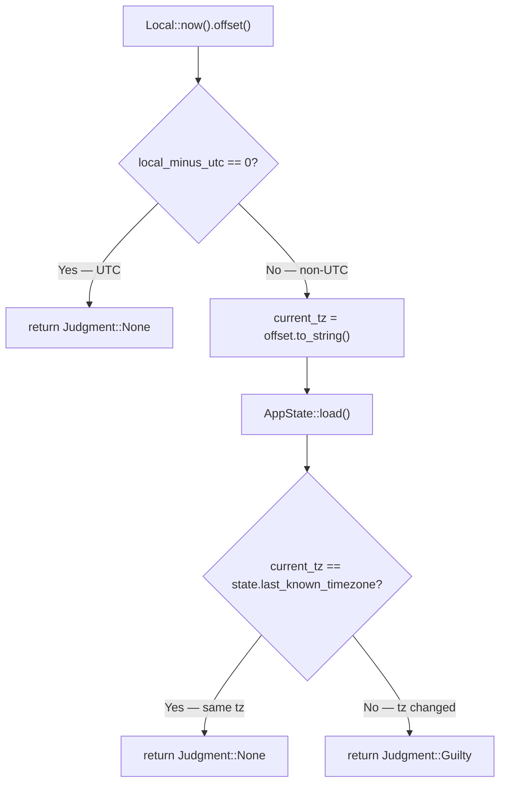
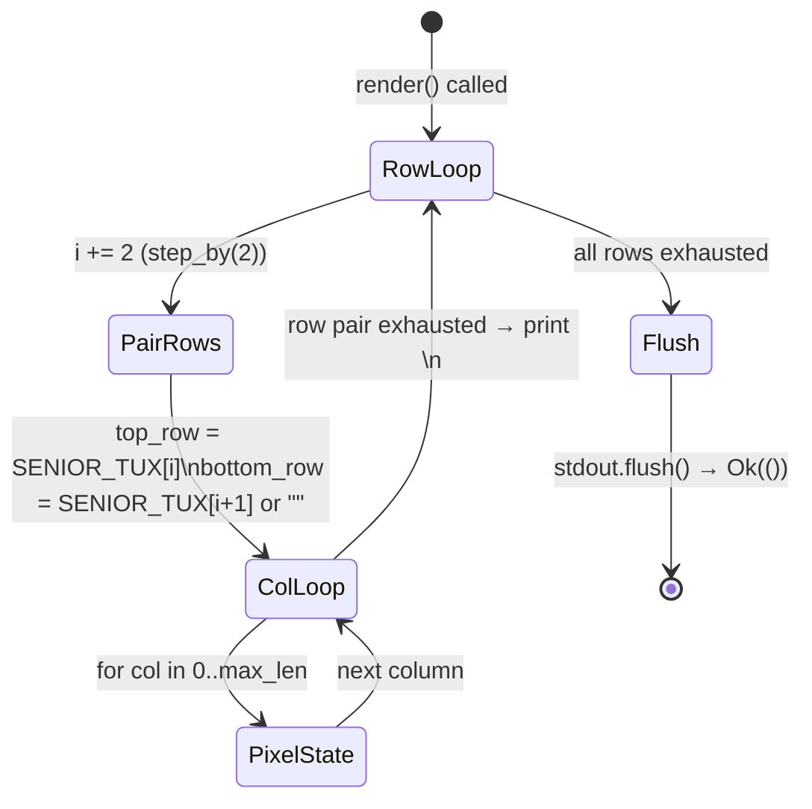
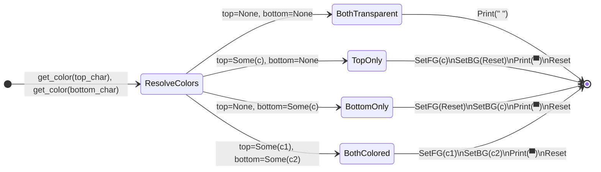
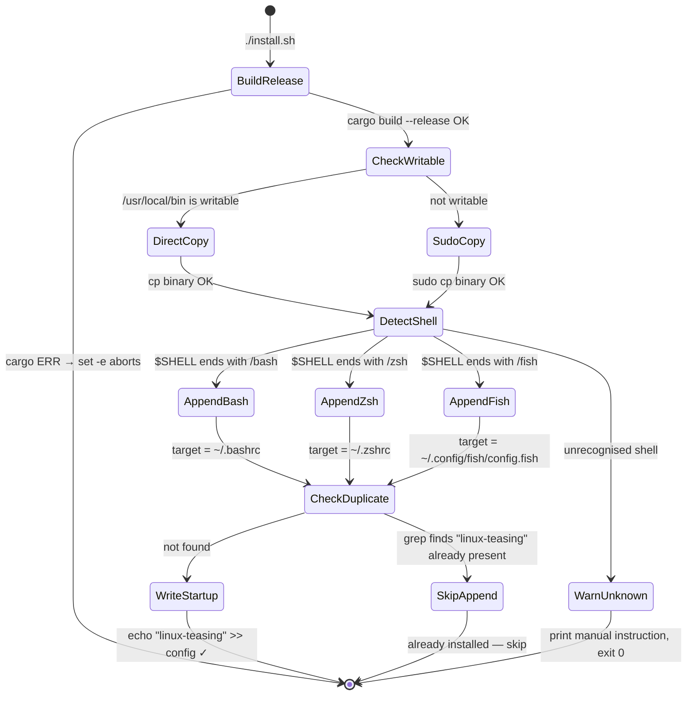
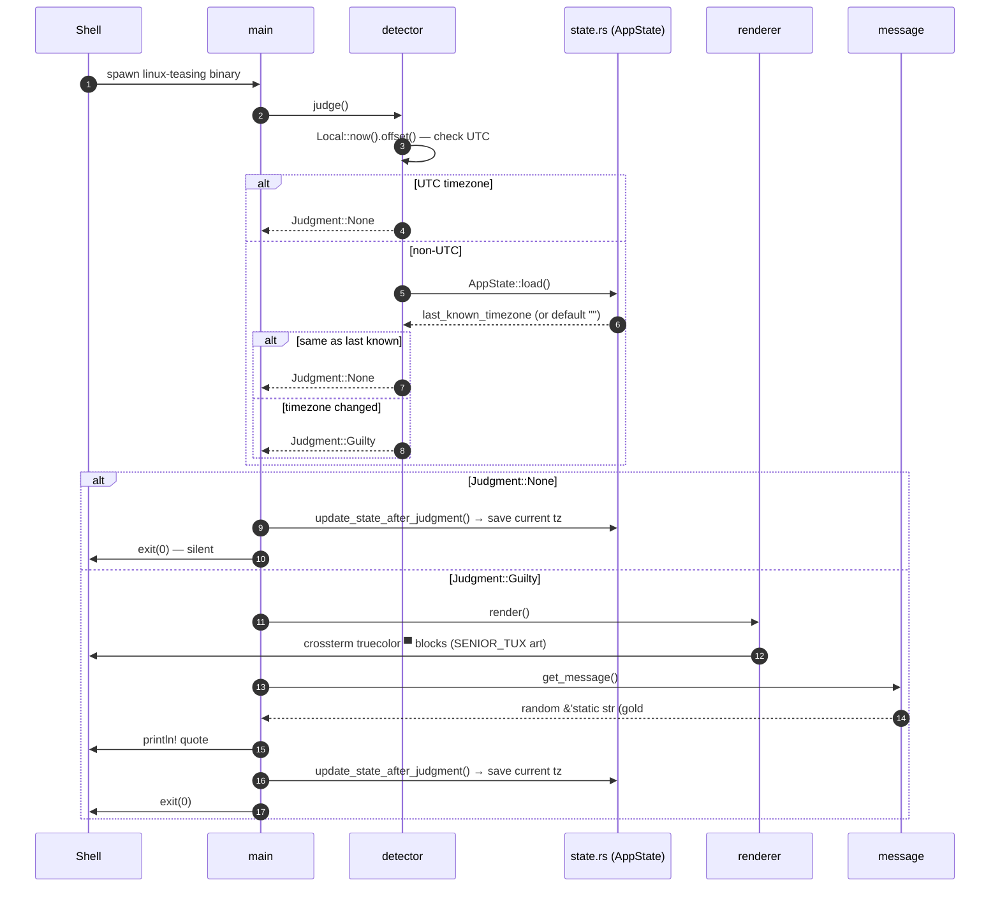

# LinuxTeasing — State Machine Reference

> Source of truth: read the `.rs` files directly. This document is generated from code analysis.  
> All diagrams use Mermaid.js v11 `stateDiagram-v2` and `flowchart` syntax.

---

## Table of Contents

1. [Binary Lifecycle](#1-binary-lifecycle)
2. [Timezone Judgment](#2-timezone-judgment)
3. [State File Persistence](#3-state-file-persistence)
4. [Pixel Renderer](#4-pixel-renderer)
5. [Install Script](#5-install-script)
6. [Cross-component Data Flow](#6-cross-component-data-flow)

---

## 1. Binary Lifecycle

**File:** `src/main.rs`

The top-level orchestrator. The binary runs once, takes exactly one path, then exits with code `0`.

```mermaid
stateDiagram-v2
    direction LR

    [*] --> Judging : binary starts

    Judging --> Silent   : Judgment::None
    Judging --> Guilty   : Judgment::Guilty

    Silent --> SaveState : update_state_after_judgment()
    SaveState --> [*]    : exit(0)

    Guilty --> RenderArt  : renderer::render()
    RenderArt --> PrintMsg : message::get_message()
    PrintMsg --> SaveState2 : update_state_after_judgment()
    SaveState2 --> [*]    : exit(0)
```

**Key invariant:** `update_state_after_judgment()` is called on **both** branches. State is always synced regardless of outcome.

---

## 2. Timezone Judgment

**File:** `src/detector.rs`

The decision engine. Produces a `Judgment` enum consumed by `main.rs`. No side effects — state is **not** written here, only read.

```mermaid
stateDiagram-v2
    direction TB

    [*] --> CheckUTC : Local::now().offset()

    CheckUTC --> EmitNone   : local_minus_utc == 0\n(UTC timezone)
    CheckUTC --> LoadState  : offset != 0

    LoadState --> CompareTimezone : AppState::load()

    CompareTimezone --> EmitNone   : current_tz == last_known_tz\n(same as recorded)
    CompareTimezone --> EmitGuilty : current_tz != last_known_tz\n(new non-UTC timezone)

    EmitNone   --> [*] : Judgment::None
    EmitGuilty --> [*] : Judgment::Guilty
```

**Offset string format:** `chrono::FixedOffset::to_string()` produces `+07:00`, not an IANA name.  
Two IANA zones at the same offset (e.g. `Asia/Bangkok` and `Asia/Ho_Chi_Minh`, both `+07:00`) are treated as **identical** — intentional design choice.



---

## 3. State File Persistence

**File:** `src/state.rs`

Manages `state.json` via `AppState`. Two operations: `load()` (read-or-default) and `save()` (write-or-create).

```mermaid
stateDiagram-v2
    direction LR

    %% --- LOAD path ---
    [*]          --> CheckFile    : AppState::load()
    CheckFile    --> ReadContent  : file exists
    CheckFile    --> ReturnDefault : file absent

    ReadContent  --> ParseJSON    : fs::read_to_string OK
    ReadContent  --> ReturnDefault : fs::read_to_string ERR

    ParseJSON    --> ReturnLoaded  : serde_json::from_str OK
    ParseJSON    --> ReturnDefault : serde_json::from_str ERR

    ReturnLoaded  --> [*] : AppState { last_known_timezone, last_judgment_timestamp }
    ReturnDefault --> [*] : AppState::default() — empty strings / 0

    %% --- SAVE path ---
    [*]           --> EnsureDir   : AppState::save()
    EnsureDir     --> WriteFile   : fs::create_dir_all OK
    EnsureDir     --> ErrReturn   : fs::create_dir_all ERR

    WriteFile     --> [*]         : Ok(()) — file written
    WriteFile     --> ErrReturn   : fs::write ERR
    ErrReturn     --> [*]         : Err(io::Error) — silently ignored in main
```

**State file paths:**

| Platform | Path |
|----------|------|
| Linux    | `~/.config/linux-teasing/state.json` |
| Windows  | `%APPDATA%\LinuxTeasing\config\state.json` |
| Fallback | `.config/linux-teasing/state.json` (relative) |

**Schema:**
```json
{
  "last_known_timezone": "+07:00",
  "last_judgment_timestamp": 1740873600
}
```

**Reset trigger:** Delete the state file → next run with any non-UTC timezone will fire `Judgment::Guilty`.

---

## 4. Pixel Renderer

**File:** `src/renderer.rs`

Renders `SENIOR_TUX` (`&[&str]` color-key grid) to truecolor terminal output.  
Consumes rows **two at a time**, pairing `top_row[i]` + `bottom_row[i+1]` into a single terminal line using `▀` (U+2580 Upper Half Block).

### 4a. Row Iteration State Machine



### 4b. Per-Pixel Color State Machine

Each character position resolves `top_color` and `bottom_color` via `get_color()`, then enters one of four states:



### 4c. Color Key → RGB Mapping

| Char | State Name | RGB | Visual role |
|------|-----------|-----|-------------|
| `B` | Black body | `#222222` | Body outline |
| `W` | White belly | `#F0F0F0` | Chest / belly |
| `Y` | Yellow | `#FFAE00` | Beak, feet |
| `G` | Gray mug | `#5D5D5D` | Coffee mug frame |
| `C` | Coffee brown | `#6F4E37` | Coffee liquid |
| `Z` | Light gray | `#AAAAAA` | Eyes |
| ` ` | Transparent | _(terminal BG)_ | Empty space |

---

## 5. Install Script

**File:** `install.sh` (Linux/macOS) — `install.ps1` (Windows)



---

## 6. Cross-component Data Flow

End-to-end sequence from shell open to screen output.



---

## Appendix: State Transition Summary Table

| Machine | States | Trigger | Terminal state |
|---------|--------|---------|---------------|
| Binary Lifecycle | Judging → Silent\|Guilty → SaveState | binary spawn | exit(0) always |
| Timezone Judgment | CheckUTC → LoadState → Compare | `judge()` call | `Judgment::None` or `::Guilty` |
| State File | CheckFile → Read → Parse → Return | `load()` / `save()` | `AppState` struct or `Err` |
| Pixel Renderer | RowLoop → ColLoop → PixelState (×4) | `render()` call | `Ok(())` or `io::Err` |
| Install Script | Build → Copy → DetectShell → Append | `./install.sh` | config written or warned |
