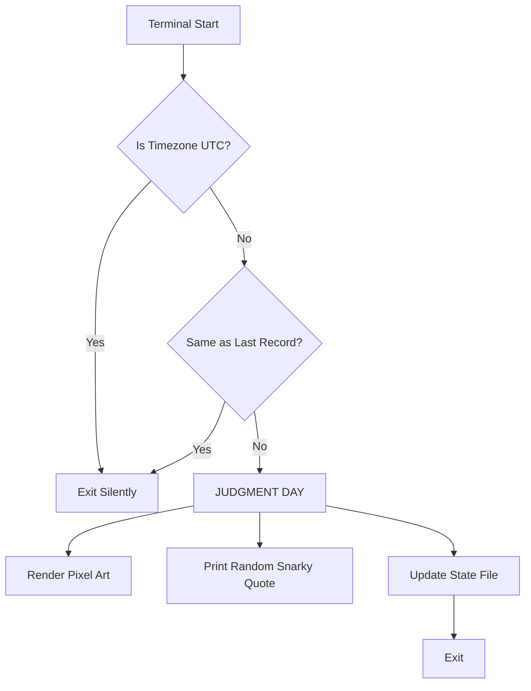

# Getting Started with LinuxTeasing

Welcome to **LinuxTeasing**! This guide will help you install, configure, and understand how the tool works.

## Prerequisites

- **Rust Toolchain**: You need generic Rust installed to build from source.
  - Install via [rustup.rs](https://rustup.rs).
- **Terminal**: A terminal emulator with **TrueColor** support (most modern terminals like Alacritty, iTerm2, Windows Terminal support this).

## Installation Guide

### Option 1: Automated Script (Recommended)

#### Linux / Unix
We provide a bash script that builds the release binary and installs it to `/usr/local/bin`.

1.  Open your terminal.
2.  Navigate to the project root.
3.  Run:
    ```bash
    ./install.sh
    ```
4.  **Restart your terminal** or source your rc file (e.g., `source ~/.bashrc`).

#### Windows (PowerShell)
We provide a PowerShell script that builds and installs to your AppData folder.

1.  Open PowerShell.
2.  Navigate to the project root.
3.  Run:
    ```powershell
    ./install.ps1
    ```
4.  **Restart PowerShell** to verify the `PATH` update.

### Option 2: Manual Installation

If you prefer to install manually:

1.  **Build the project**:
    ```bash
    cargo build --release
    ```
2.  **Locate the binary**:
    The compiled binary is at `target/release/linux-teasing` (or `.exe` on Windows).
3.  **Move to PATH**:
    Copy the binary to a folder in your system `PATH` (e.g., `/usr/local/bin` or `~/.local/bin`).
4.  **Add to Shell Startup**:
    Add the command `linux-teasing` to the end of your shell configuration file (e.g., `.bashrc`, `.zshrc`, `config.fish`, or PowerShell `$PROFILE`).

## How It Works

LinuxTeasing runs every time you open a terminal. It checks two things:
1.  **Your Timezone**: Are you on UTC?
2.  **Your History**: Have we already judged you for this specific timezone?

### The Logic Flow



## Troubleshooting

### "I don't see the penguin!"
- **Are you on UTC?** If your system time is UTC, the penguin is happy and stays silent.
- **Have you already seen it?** The tool only judges you **once** per timezone change. To force it to judge you again, delete the state file.
  - Linux: `rm ~/.config/linux-teasing/state.json`
  - Windows: Remove `state.json` from your AppData config folder.
- **Check your colors**: Ensure your terminal supports TrueColor (24-bit color).

### "The colors look weird"
- LinuxTeasing uses hardcoded high-fidelity RGB values. If your terminal forces a specific color palette or theme that overrides RGB, it might look different.

---

**Enjoy your disciplined UTC lifestyle!** 🐧
