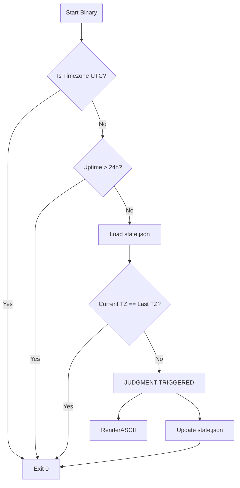

# 🏗️ LinuxTeasing Architecture

## Overview
LinuxTeasing is designed to be **invisible unless necessary**. It follows the "Silent Success, Loud Failure" philosophy commonly found in Unix tools, but adapted for user behavior modification.

## Component Design

### 1. The Detector (`detector.rs`)
The sophisticated logic gate that prevents user annoyance.

### 2. State Management (`state.rs`)
- **Persistence:** JSON. Human-readable, easy to debug.
- **Location:** `~/.linux-teasing/state.json` (Cross-platform).
- **Concurrency:** None. The tool runs sequentially on startup. No lock files needed.

### 3. Cross-Platform Strategy
- **File Systems:** Uses `directories` crate to respect XDG (Linux) and Known Folders (Windows).
- **System Info:** Uses `sysinfo` to abstract `procfs` (Linux) and Windows APIs for boot time.

## Performance Considerations
- **Binary Size:** Stripped release build expected < 5MB.
- **Startup Time:** < 50ms.
    - `sysinfo` is only initialized for necessary components (`RefreshKind`).
    - No network calls.
    - No heavy assets (ASCII is strict const string).
